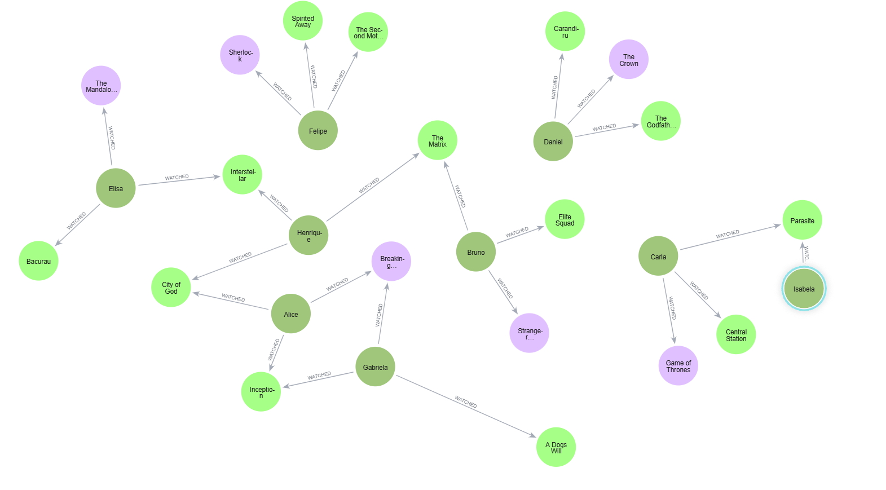
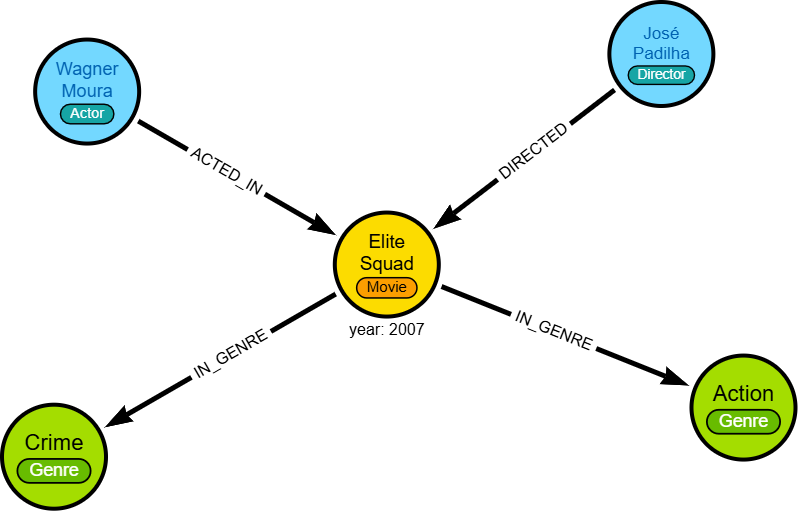
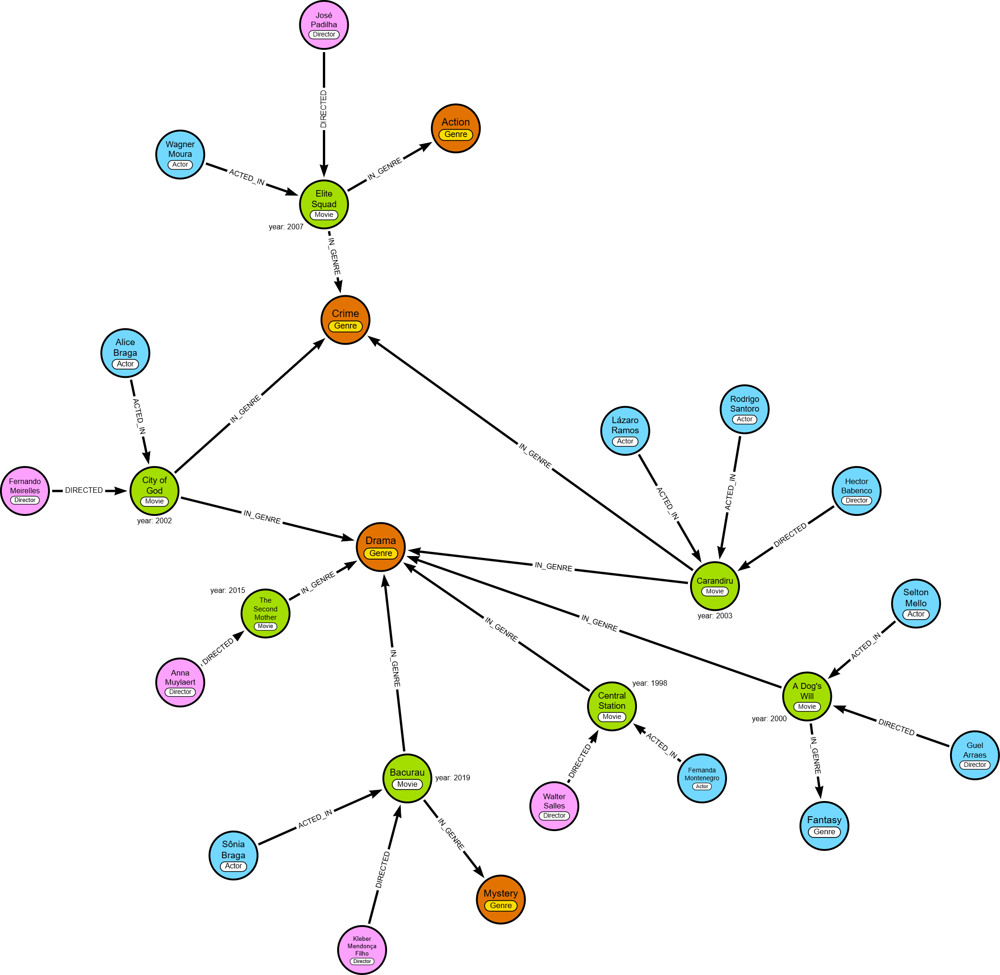

# Desafio 01 — Modelagem de Dados em Grafos para um Serviço de Streaming

Este repositório contém a solução do desafio de modelagem do Bootcamp Neo4j (DIO): um pequeno grafo de conhecimento para um serviço de streaming, com diagrama do modelo e um script Cypher que cria constraints e popula o banco com dados de exemplo.

## Contexto

Serviços de streaming dependem de relacionamentos ricos: usuários assistem títulos, atores participam de produções, diretores comandam títulos, e obras pertencem a gêneros. Responder perguntas de navegação (“quais filmes com este diretor e este ator?”, “o que pessoas parecidas assistiram?”) exige a construção de conexões mais complexas e diversas.

### Requisitos do desafio
- Nós: User, Movie, Series, Genre, Actor, Director.
- Relacionamentos: WATCHED (com propriedade `rating`), ACTED_IN, DIRECTED, IN_GENRE.
- Entregas: diagrama do grafo e script `.cypher` com constraints e pelo menos 10 usuários, 10 filmes/séries e seus relacionamentos.

## Por que utilizar grafos (Neo4j)?
- Modelam naturalmente redes ricas e heterogêneas, evitando junções custosas em consultas multi-hop.
- Esquema flexível para evoluir o domínio (novas propriedades/labels sem migrações pesadas).
- Cypher expressa consultas de caminho de forma concisa e legível.
- Indexação/constraints por label garantem unicidade e bom desempenho.

## Modelagem

### Entidades (labels) e propriedades
- User: `id`, `name`.
- Movie: `id`, `title`, `year`, `duration`.
- Series: `id`, `title`, `startYear`, `seasons`.
- Genre: `id`, `name`.
- Actor: `id`, `name`.
- Director: `id`, `name`.

### Relacionamentos
- (User)-[WATCHED {rating}]->(Movie|Series)
- (Actor)-[ACTED_IN]->(Movie|Series)
- (Director)-[DIRECTED]->(Movie|Series)
- (Movie|Series)-[IN_GENRE]->(Genre)

## Diagrama do Grafo

Abaixo, a visualização do modelo de grafo:



### Exemplo — Elite Squad



Cypher correspondente:

```cypher
CREATE (:Actor)-[:ACTED_IN]->(`Elite Squad`:Movie {year: 2007})<-[:DIRECTED]-(:Director),
(:Genre)<-[:IN_GENRE]-(`Elite Squad`)-[:IN_GENRE]->(:Genre)
```

## Como executar

### Pré-requisitos
- Neo4j 5.x (Desktop, AuraDB ou Server) e/ou `cypher-shell`.

### Opção A — Neo4j Browser
1. Inicie o banco e abra o Browser.
2. Abra o arquivo `desafio_01.cypher`, copie o conteúdo e execute.

### Opção B — cypher-shell
Execute trocando a senha conforme seu ambiente:

```bash
cypher-shell -u neo4j -p <senha> -f "d:\01 - Cursos\02 - DIO\15 - BOOTCAMP NEO4J\01 - Desafios\desafio_01\desafio_01.cypher"
```

Notas:
- O script usa `MERGE` e `CREATE CONSTRAINT … IF NOT EXISTS`, portanto é idempotente.
- Dados incluem títulos internacionais e brasileiros (atores/diretores/filmes).

## Consultas de verificação

```cypher
// contagens
MATCH (u:User) RETURN count(u) AS users;
MATCH (m:Movie) RETURN count(m) AS movies;
MATCH (s:Series) RETURN count(s) AS series;
MATCH ()-[r:WATCHED]->() RETURN count(r) AS watched;

// amostras
MATCH (u:User)-[w:WATCHED]->(c) RETURN u.name, labels(c)[0] AS tipo, c.title, w.rating LIMIT 10;
MATCH (a:Actor)-[:ACTED_IN]->(c) RETURN a.name, labels(c)[0] AS tipo, c.title LIMIT 10;
MATCH (d:Director)-[:DIRECTED]->(c) RETURN d.name, labels(c)[0] AS tipo, c.title LIMIT 10;
```

## Queries de Negócio e Evidências Visuais

- Perguntas de negócio que podem ser respondidas pelo modelo:
  - Quais os top títulos por gênero com melhor média de rating?
  - Que títulos recomendar para um usuário com base nos seus gêneros preferidos?
  - Quais co-atores contracenaram com um determinado ator?
  - Quais diretores são mais assistidos por um usuário e com que avaliação média?
  - Em quais gêneros um ator atua com mais frequência?
  - Quais filmes brasileiros, seus elencos e diretores?
  - Qual o caminho mais curto entre dois atores via obras em comum?
  - Quais séries são mais bem avaliadas por quem assistiu um filme específico?
  - Quais títulos do mesmo diretor e gênero usuários semelhantes tendem a assistir?
  - Quais atores aparecem com maior frequência nos títulos assistidos?

- Arquivo com as consultas: [queries_negocio.cypher](file:///d:/01%20-%20Cursos/02%20-%20DIO/15%20-%20BOOTCAMP%20NEO4J/01%20-%20Desafios/desafio_01/queries_negocio.cypher)


### Evidência — Elite Squad (conecta com “filmes brasileiros, elencos e diretores” e “gêneros por ator”)


Consultas para gerar a visualização:

```cypher
// Subgrafo: atores, diretor e gêneros do filme Elite Squad
MATCH (a:Actor)-[:ACTED_IN]->(m:Movie {title: 'Elite Squad'})<-[:DIRECTED]-(d:Director)
OPTIONAL MATCH (m)-[:IN_GENRE]->(g:Genre)
RETURN a, m, d, g;
```

```cypher
// Elenco e diretor do filme Elite Squad
MATCH (m:Movie {title: 'Elite Squad'})
OPTIONAL MATCH (m)<-[:ACTED_IN]-(a:Actor)
OPTIONAL MATCH (m)<-[:DIRECTED]-(d:Director)
RETURN m.title AS movie, collect(DISTINCT a.name) AS cast, collect(DISTINCT d.name) AS directors;
```

### Evidência — Cluster Cinema Brasileiro (associado a arrows_brazil_films.json)

Como reproduzir:
- Importe o arquivo [arrows_brazil_films.json](file:///d:/01%20-%20Cursos/02%20-%20DIO/15%20-%20BOOTCAMP%20NEO4J/01%20-%20Desafios/desafio_01/arrows_brazil_films.json) no Arrows.app e exporte o PNG.
- Ou gere via Cypher:

```cypher
// Subgrafo de filmes brasileiros, seus gêneros, elencos e diretores
MATCH (m:Movie)
WHERE m.title IN ['City of God','Elite Squad','Central Station','Bacurau','The Second Mother','Carandiru','A Dog''s Will']
OPTIONAL MATCH (m)-[:IN_GENRE]->(g:Genre)
OPTIONAL MATCH (a:Actor)-[:ACTED_IN]->(m)
OPTIONAL MATCH (d:Director)-[:DIRECTED]->(m)
RETURN m, g, a, d;
```

Imagem gerada:



Cypher demonstrativo equivalente:

```cypher
CREATE (:Actor)-[:ACTED_IN]->(`Central Station`:Movie {year: 1998})-[:IN_GENRE]->(Drama:Genre)<-[:IN_GENRE]-(`City of God`:Movie {year: 2002})-[:IN_GENRE]->(Crime:Genre)<-[:IN_GENRE]-(`Elite Squad`:Movie {year: 2007})<-[:ACTED_IN]-(:Actor),
(:Director)-[:DIRECTED]->(`Elite Squad`)-[:IN_GENRE]->(:Genre),
(:Director)-[:DIRECTED]->(:Movie {year: 2015})-[:IN_GENRE]->(Drama)<-[:IN_GENRE]-(Bacurau:Movie {year: 2019})-[:IN_GENRE]->(:Genre),
(:Actor)-[:ACTED_IN]->(`A Dog's Will`:Movie {year: 2000})-[:IN_GENRE]->(Drama)<-[:IN_GENRE]-(Carandiru:Movie {year: 2003})-[:IN_GENRE]->(Crime),
(:Director)-[:DIRECTED]->(`A Dog's Will`)-[:IN_GENRE]->(:Genre),
(:Actor)-[:ACTED_IN]->(`City of God`)<-[:DIRECTED]-(:Director),
(:Actor)-[:ACTED_IN]->(Carandiru)<-[:ACTED_IN]-(:Actor),
(:Actor)-[:ACTED_IN]->(Bacurau)<-[:DIRECTED]-(:Director),
(:Director)-[:DIRECTED]->(`Central Station`),
(:Director)-[:DIRECTED]->(Carandiru);
```

- Diagramas prontos para Arrows.app (importar via “Open → Import JSON”):
  - Modelo conceitual: [arrows_model_overview.json](file:///d:/01%20-%20Cursos/02%20-%20DIO/15%20-%20BOOTCAMP%20NEO4J/01%20-%20Desafios/desafio_01/arrows_model_overview.json)
  - Cluster cinema brasileiro: [arrows_brazil_films.json](file:///d:/01%20-%20Cursos/02%20-%20DIO/15%20-%20BOOTCAMP%20NEO4J/01%20-%20Desafios/desafio_01/arrows_brazil_films.json)
  - Watchlist do usuário U1: [arrows_user_U1_watchlist.json](file:///d:/01%20-%20Cursos/02%20-%20DIO/15%20-%20BOOTCAMP%20NEO4J/01%20-%20Desafios/desafio_01/arrows_user_U1_watchlist.json)
  - Foco no ator Wagner Moura: [arrows_actor_wagner_moura.json](file:///d:/01%20-%20Cursos/02%20-%20DIO/15%20-%20BOOTCAMP%20NEO4J/01%20-%20Desafios/desafio_01/arrows_actor_wagner_moura.json)
  - Destaques do gênero Drama: [arrows_genre_drama_highlights.json](file:///d:/01%20-%20Cursos/02%20-%20DIO/15%20-%20BOOTCAMP%20NEO4J/01%20-%20Desafios/desafio_01/arrows_genre_drama_highlights.json)

Observação: os arquivos JSON seguem a estrutura de nós e relacionamentos do Arrows.app (campos `nodes` com `id`, `labels`, `caption`, `properties` e `relationships` com `type`, `fromId`, `toId`, `properties`). Após importar, ajuste o layout manualmente e exporte o PNG para compor as evidências.

## Desafios e dificuldades da modelagem

- Delimitar Movie vs. Series: decidir propriedades específicas (duration vs. seasons/startYear) mantendo navegação uniforme e consistente.
- Propriedades incluídas em relacionamentos: `rating` em WATCHED modela avaliação por usuário; exige decisões sobre tipo, escala e atualização.
- Identificadores estáveis: escolher `id` legível e único por label, garantindo idempotência com `MERGE`.
- Cardinalidade e duplicidades: evitar múltiplos WATCHED para o mesmo par (User, Conteúdo) e normalizar IN_GENRE.
- Pessoas com múltiplos papéis: um mesmo indivíduo pode atuar e dirigir; aqui separam-se labels Actor e Director, mas em cenários reais pode-se unificar em `Person` com relacionamentos específicos.
- Catálogo de gêneros: padronização de nomes e possibilidade de hierarquias (ex.: subgêneros) pode exigir um grafo de taxonomia.
- Evolução do esquema: inclusão de países, idiomas, plataformas e temporadas/episódios amplia a complexidade e o volume de dados.
- Inserção de dados quando o volume é grande. (No caso de um sistema real, os dados que se referem às interações com usuários são incluídos de forma gradual, mas os dados referentes aos filmes, pelo menos da primeira vez, precisam ser incluídos em lote.)

## Estrutura do repositório
- `visualisation.png` — Visualização do modelo de grafo.
- `filmes_brasil.png` — Cluster cinema brasileiro.
- `desafio_01.cypher` — Script de constraints e carga de dados (internacionais e brasileiros).
- arquivos json que podem ser importados no arrows.app:
  - `arrows_model_overview.json` — Modelo conceitual.
  - `arrows_brazil_films.json` — Cluster cinema brasileiro.
  - `arrows_user_U1_watchlist.json` — Watchlist do usuário U1.
  - `arrows_actor_wagner_moura.json` — Foco no ator Wagner Moura.
  - `arrows_genre_drama_highlights.json` — Destaques do gênero Drama.
- `README.md` — Este guia.
